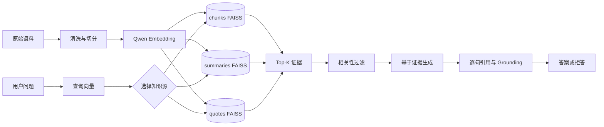
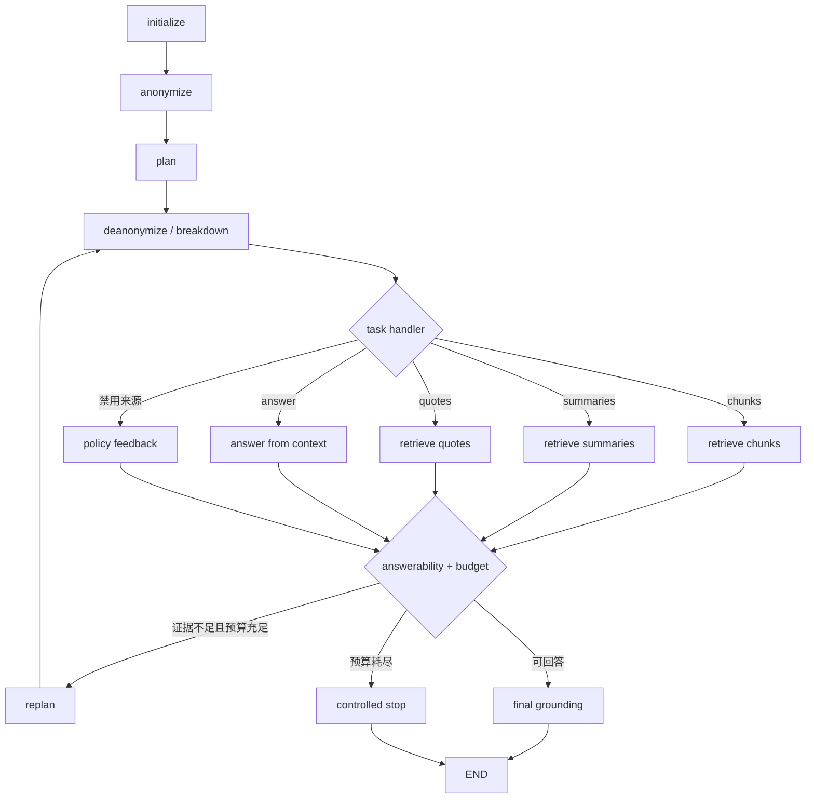
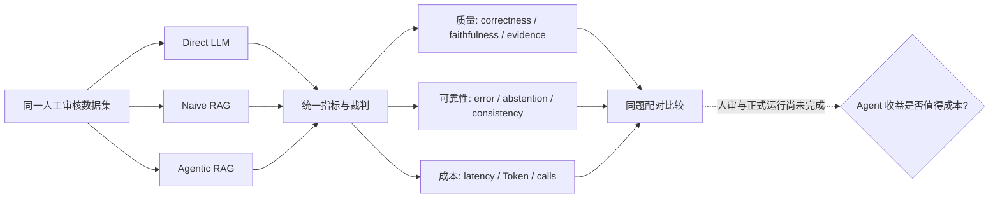

# Agent / RAG 面试白板图

只练三张图。每张图应在 2 分钟内画完，再用 3 分钟解释；箭头对应当前仓库实现，虚线表示
尚未产生的正式证据。不要把所有可靠性组件都塞进第一张图。

## 图 1：RAG 数据链——知识怎样变成答案



### 讲解顺序

1. **离线侧：** 语料经过切分、`text-embedding-v4` 向量化并形成三套 FAISS 索引；manifest
   绑定模型、维度和文件 hash。
2. **在线侧：** 问题被路由到不同粒度知识源，Top-K 召回后过滤，再进入生成。
3. **可信侧：** 生成结果不是结束；每个事实句必须关联白名单 evidence ID，验证失败有限重试，
   最终可以拒答。
4. **取舍：** chunk、Top-K 和来源数量同时影响召回、噪声、Token 与延迟，不能单看一个指标。

代码落点：`rebuild_vector_stores.py`、`controllable_rag/retrieval.py`、
`controllable_rag/index_manifest.py`、`controllable_rag/citations.py` 和
`controllable_rag/nodes.py::verify_answer`。

高频追问：为什么三套索引；换 Embedding 但维度不变为何仍要重建；Top-K 增大为何可能变差；
引用存在为什么不等于答案受到支持。

## 图 2：Agent 控制流——为什么需要 LangGraph



检索节点内部还有一个有界子图：

```text
retrieve → filter → verify ─ grounded → 返回主图
                      ├─ retry ─────→ filter
                      └─ failed ─────→ 返回主图
```

### 讲解顺序

1. **为什么不是 Chain：** 这里需要按任务路由、根据新证据循环、显式终止以及可选 checkpoint。
2. **State 做什么：** `PlanExecute` 保存计划、历史步骤、证据、引用、预算和终止原因；节点返回
   状态增量，条件边决定下一步。
3. **replan 的价值与风险：** 仅证据不足且预算充足才重规划；它可能改变剩余步骤，也增加
   调用、漂移和死循环风险，因此必须与 naive RAG 对照，并受多层预算限制。
4. **“可控”的含义：** 来源、Top-K、最低证据、步骤、Chat/Embedding 调用、Token、deadline
   和 grounding 次数均有限制，不等同于 temperature=0。

代码落点：`controllable_rag/graph.py::create_agent`、`controllable_rag/schemas.py`、
`controllable_rag/nodes.py::route_tool`、`replan`、`route_after_assessment` 和
`controllable_rag/runtime.py::BoundedAgent`。

高频追问：replan 是否只增加 Token；为什么 Prompt 禁用工具还不够；max_steps 为什么不能
替代 Token 预算；checkpoint 恢复后预算是否重置。

## 图 3：三基线评测——怎样证明 Agent 值得复杂度



### 讲解顺序

1. **Direct** 测模型记忆；**Naive RAG** 测一次检索收益；**Agentic RAG** 再测规划、路由和
   循环增量，缺少任何一组都难以归因。
2. 三组使用同题、同模型和统一规则；质量之外还看错误、拒答、P50/P95、Token 和调用数。
3. 同一道题的结果天然配对，所以先聚合完整重复，再对 case-level 差值做 paired bootstrap。
4. Agent 只有出现可重复质量收益、无主要指标显著退化且额外成本可接受时才值得保留。

代码落点：`evaluation/run_evaluation.py::SYSTEMS`、`run_system`、`build_summary`、
`build_pairwise_comparisons`，以及 `evaluation/formal_quality.py` 和
`evaluation/review_workflow.py`。

当前必须主动说明：52 条数据尚未全部人工批准（精确数字见人审进度证据）；三系统正式实验尚未运行；已有测试只证明
评测程序和门禁契约，不证明 Agent 质量更高。

## 白板评分

每张图四项各 1 分：核心方框能定位代码；能解释一个设计取舍；能回答两个追问；能主动说明
未验证边界。单图达到 4 分才算通过。虚构指标或把上游设计说成个人原创，该图直接判 0 分。
